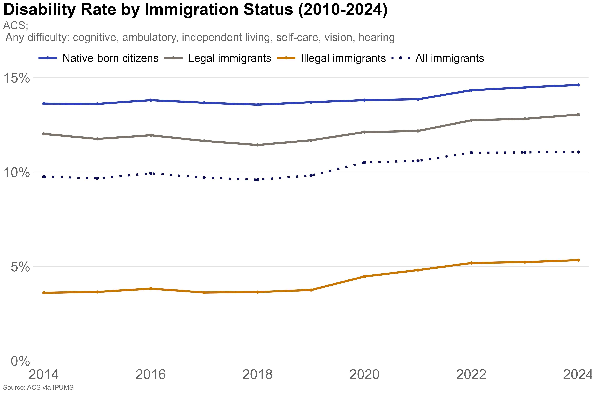
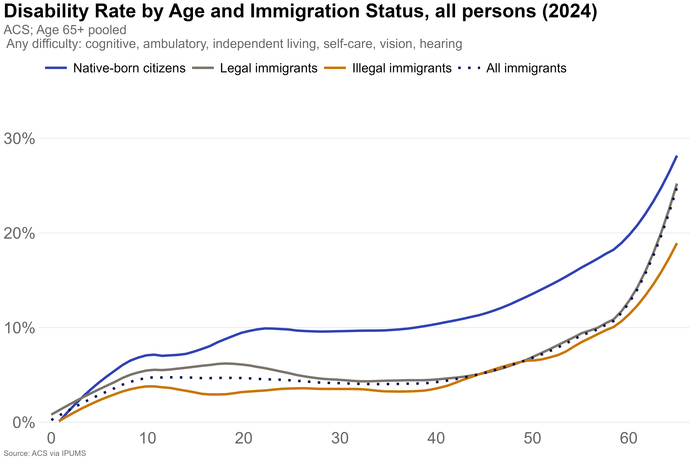

# Immigrants are 24% Less Likely to be Disabled Than US-born Citizens"
> Estimating disability rates and disability income among US-born citizens, legal immigrants, and illegal immigrants, using a residual method applied to ACS and CPS-ASEC microdata (2014-2024)

### Instructions for replication
- Data extracts from IPUMS
- Residual method and data cleaning files for both ACS and CPS are in [data-code](https://github.com/carol-xu4/Immigrants-are-24-Less-Likely-to-be-Disabled-Than-US-born-Citizens/tree/main/data-code)
- Cleaning files create new data files in a "data/output folder", with imputed immigration status (after residual method)
- Analysis code can be found in [analysis](https://github.com/carol-xu4/Immigrants-are-24-Less-Likely-to-be-Disabled-Than-US-born-Citizens/tree/main/analysis)
- All tables and plots are saved in [results](https://github.com/carol-xu4/Immigrants-are-24-Less-Likely-to-be-Disabled-Than-US-born-Citizens/tree/main/results)

### Disability rates among US-born citizens and immigrants, 2024

| Immigration Status    | Disabled Population | Total Population | Disability Rate |
|------------------------|---------------------|-------------------|------------------|
| Native-born Citizens   | 42,371,405           | 289,833,257        | 14.6%            |
| Legal Immigrants       | 4,954,743             | 37,975,484          | 13.0%            |
| Illegal Immigrants     | 700,294               | 13,122,433          | 5.3%             |
| All Immigrants         | 5,655,037             | 51,097,917          | 11.1%  

[View full data (table1.csv)](https://github.com/carol-xu4/Immigrants-are-24pct-Less-Likely-to-be-Disabled-Than-US-born-Citizens/blob/main/results/table1.csv)

### Disability rates by immigration status, 2014-2024

### Immigrants are less likely to be disabled at every age group

### Share of US-born citizens and immigrants receiving disability income, 2024
civilians age 15 and older

| Immigration Status    | Sample Size (n) | Population   | SS %  | SSI % | Other % | Any % |
|------------------------|------------------|---------------|-------|-------|---------|-------|
| Native-born Citizens   | 93,348           | 226,898,892    | 2.79  | 1.96  | 1.13    | 5.11  |
| Legal Immigrants       | 14,853           | 36,355,812     | 1.79  | 1.42  | 0.75    | 3.58  |
| Illegal Immigrants     | 5,769            | 15,017,157     | 0.00  | 0.00  | 0.26    | 0.26  |
| All Immigrants         | 20,622           | 51,372,968     | 1.27  | 1.01  | 0.61    | 2.61  |

[View full data (fig.3.csv)](https://github.com/carol-xu4/Immigrants-are-24pct-Less-Likely-to-be-Disabled-Than-US-born-Citizens/blob/main/results/fig.3.csv)

### Immigrants are less likely to receive government disability income
disability benefit receipt among the disabled population, 2024

| Immigration Status    | Sample Size (n) | Population   | SS %  | SSI % | Other % | Any % |
|------------------------|------------------|---------------|-------|-------|---------|-------|
| Native-born Citizens   | 12,874           | 31,199,006     | 12.25 | 8.94  | 3.65    | 21.36 |
| Legal Immigrants       | 1,455            | 3,528,650      | 9.92  | 7.46  | 2.29    | 17.31 |
| Illegal Immigrants     | 150              | 365,954        | 0.00  | 0.00  | 0.39    | 0.39  |
| All Immigrants         | 1,605            | 3,894,603      | 8.99  | 6.76  | 2.11    | 15.72 |

[View full data (fig.4.csv)](https://github.com/carol-xu4/Immigrants-are-24pct-Less-Likely-to-be-Disabled-Than-US-born-Citizens/blob/main/results/fig.4.csv)

### Per capita disability benefit consumption, 2024
Civilians age 15 and older

| Immigration Status    | Sample Size (n) | Population   | Disabled Population | Per Capita SS ($) | Per Capita SSI ($) | Per Capita Other ($) | Per Capita Any ($) |
|------------------------|------------------|---------------|----------------------|--------------------|----------------------|------------------------|----------------------|
| Native-born Citizens   | 93,348           | 226,898,892    | 31,199,006            | 494.93             | 211.41               | 172.60                 | 878.93               |
| Legal Immigrants       | 14,853           | 36,355,812     | 3,528,650             | 325.06             | 138.37               | 105.43                 | 568.85               |
| Illegal Immigrants     | 5,769            | 15,017,157     | 365,954               | 0.00               | 0.00                 | 30.28                  | 30.28                |
| All Immigrants         | 20,622           | 51,372,968     | 3,894,603             | 230.04             | 97.92                | 83.46                  | 411.42               |

[View full data (fig.5.csv)](https://github.com/carol-xu4/Immigrants-are-24pct-Less-Likely-to-be-Disabled-Than-US-born-Citizens/blob/main/results/fig.5.csv)
